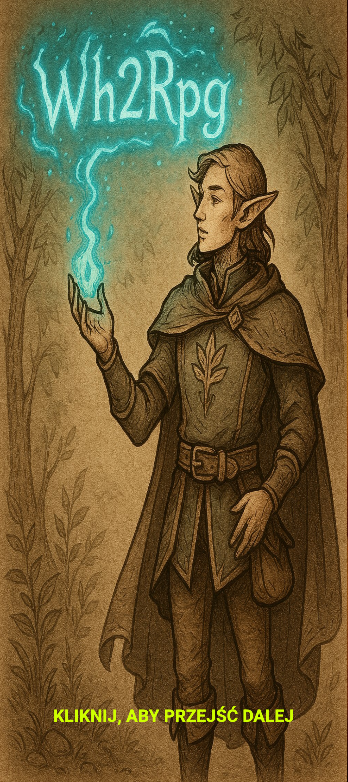
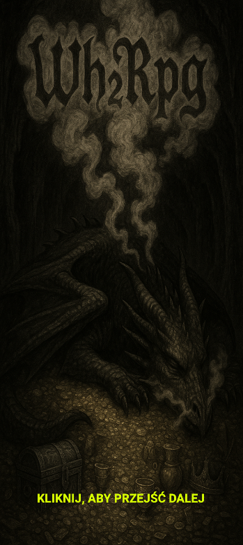
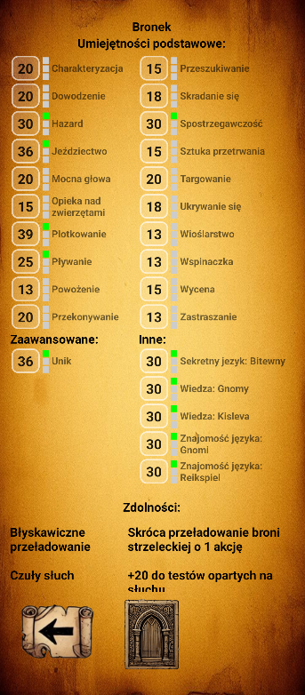

# Wh2Rpg

Fanowska aplikacja mobilna do prowadzenia karty postaci do gry fabularnej **Warhammer Fantasy Roleplay 2. edycja**.

## 🎯 Opis

Aplikacja umożliwia tworzenie i edytowanie kart postaci zgodnych z zasadami 2. edycji WFRP. Została stworzona na własny użytek jako projekt hobbystyczny – z wykorzystaniem treści z podręcznika, którego jestem legalnym właścicielem.

Głównym celem projektu było rozwijanie umiejętności programowania aplikacji mobilnych w Kotlinie oraz pracy z Firebase i nowoczesną architekturą Androida.

## 🛠 Technologie

- **Kotlin**
- **Jetpack Compose** (UI)
- **ViewModel + LiveData** (MVVM)
- **Firebase Authentication** – logowanie użytkowników
- **Firebase Firestore** – przechowywanie danych postaci
- **Lokalne przechowywanie obrazów**: Grafiki są przechowywane bezpośrednio w aplikacji lub w pamięci urządzenia
- **Google Sign-In**

## 🖼 Zrzuty ekranu

  
  
  
  

  
  
  
  

## 🚀 Uruchomienie

1. Otwórz projekt w **Android Studio**.
2. Upewnij się, że masz zainstalowane:
   - Android SDK 26+
   - Kotlin 1.8+
3. Skonfiguruj plik `google-services.json` (Firebase).
4. Uruchom aplikację na emulatorze lub fizycznym urządzeniu.

## 🧪 Demo

//TODO

## 📌 Informacja prawna

Projekt jest **fanowski** i nie jest przeznaczony do komercyjnego użytku. Wykorzystane treści są oparte na podręczniku, który posiadam prywatnie. Grafiki generowane zostały przy użyciu narzędzi AI.

## 📫 Kontakt

Jeśli chcesz się skontaktować lub porozmawiać o kodzie:

**Dariusz / Efekt**  
Email: [darkdabro@gmail.com]  
